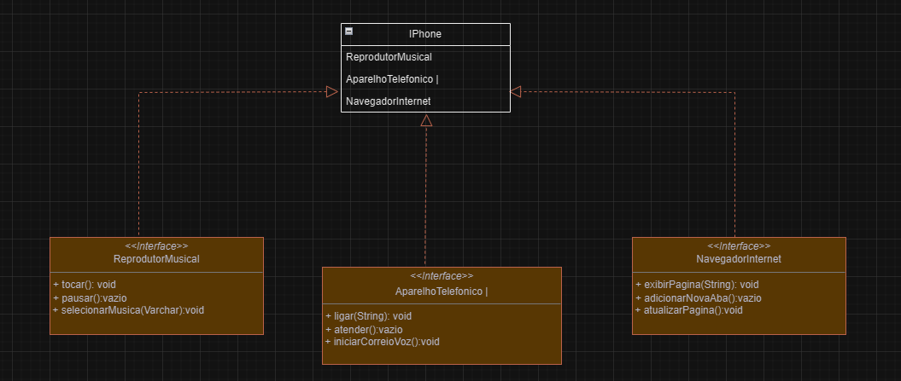

##  Desafio- Santander Bootcamp 2023 - Backend Java

Modelagem e diagramação da representação em UML e Código no que se refere ao componente iPhone.

Desafio: Elabore em uma ferramenta de UML de sua preferência a diagramação das classes e interfaces com a proposta de representar os papéis do iPhone de: 
. Reprodutor Musicial, 
. Aparelho Telefônico 
. Navegador na Internet

Em seguida crie as classes e interfaces no formato de arquivos .java
Comportamentos esperados:
Repodutor Musicial: tocar, pausar, selecionarMusica
Aparelho Telefônico: ligar, atender, iniciarCorrerioVoz
Navegador na Internet: exibirPagina, adicionarNovaAba, atualizarPagina

### Modelagem UML
    
 
 https://drive.google.com/file/d/1oQSCXUMVz2JV8oxidum_mbBAROhii6-t/view?usp=sharing

